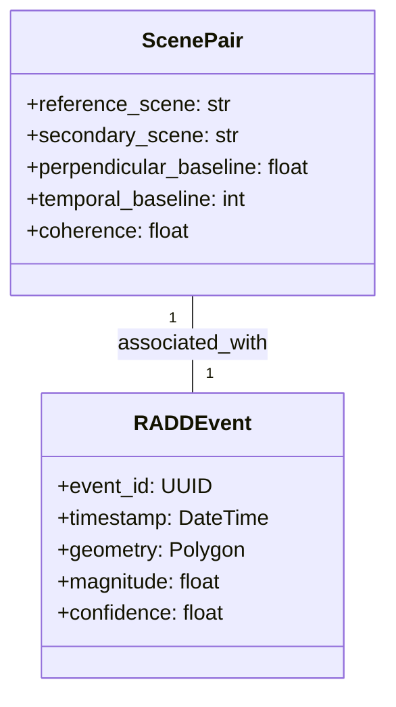
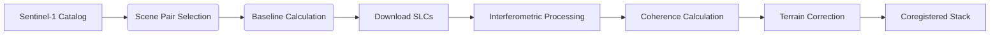

# InSAR Forest Disturbance Dataset

<!-- Developer-focused header with architecture diagram -->
<div align="center">
  
  <h1>Sentinel-1 InSAR Processing for Forest Disturbance Detection</h1>
  <p>Automated pipeline for generating interferometric coherence stacks for deforestation monitoring</p>
  
  <!-- Technical badges -->
  [](https://python.org)
  [](https://step.esa.int)
  [](https://opensource.org/licenses/MIT)
  [](https://doi.org/10.xxxx/xxxxx)
</div>

## :computer: Quick Start
```bash
# Clone repository
git clone https://github.com/ColmKeyes/InSAR_Forest_Disturbance_Dataset.git
cd InSAR_Forest_Disturbance_Dataset

# Install dependencies
conda env create -f environment.yml
conda activate insar-forest

# Run processing pipeline
python bin/1_generate_s1_catalog.py --area borneo
python bin/2_scene_pair_selector.py
python bin/4_download_s1_scenes.py
```

## :gear: API Usage
```python
from src.sentinel1slc import Sentinel1Slc

# Initialize SLC processor
processor = Sentinel1Slc(
    output_dir="data/processed",
    dem_path="data/dem.tif",
    orbit_dir="data/orbits"
)

# Process single scene
processor.process_scene("S1A_IW_SLC_20250101")
```

## :books: Documentation Hub
| Section | Description | Link |
|---------|-------------|------|
| **API Reference** | Full class/method documentation | [API.md](docs/API.md) |
| **Data Schema** | Parquet data schema specification | [SCHEMA.md](docs/SCHEMA.md) |
| **Processing Guide** | Step-by-step pipeline guide | [PROCESSING_GUIDE.md](docs/PROCESSING_GUIDE.md) |
| **Jupyter Examples** | Example notebooks for analysis | [notebooks/](notebooks/) |

## :bar_chart: Data Schema


## :test_tube: Version Compatibility
| Component | Version | Notes |
|-----------|---------|-------|
| Python | 3.10+ | Required |
| SNAP | 12.0 | ESA Sentinel Toolbox |
| GDAL | 3.8+ | Geospatial processing |
| PyroSAR | 0.16+ | SAR processing library |

## :wrench: Processing Pipeline


## :handshake: Contributing
Contributions are welcome! Please see our [contribution guidelines](CONTRIBUTING.md) for details.

---
*Developed at University College Dublin Earth Institute*
